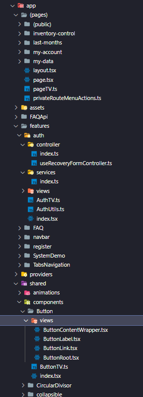

<h1 align="center">Portal Administração</h1>

<details open="open">
  <summary>Sumário</summary>
  <ol>
    <li><a href="#Tecnologias">Tecnologias</a></li>
    <li><a href="#Formulários">Formulários</a></li>
    <li><a href="#Headless Components">Headless Components</a></li>
    <li><a href="#Ícones">Ícones</a></li>
    <li><a href="#Testes">Testes</a></li>
    <li><a href="#Arquitetura">Arquitetura</a></li>
    <li><a href="#Padronização de código">Padronização de código</a></li>
    <li><a href="#Fluxo do git">Fluxo do git</a></li>
    <li><a href="#Deploy">Deploy</a></li>
    <li><a href="#Inicialização">Inicialização</a></li>
  </ol>
</details>

## Tecnologias

Tecnologias no Escopo da aplicação
* NextJs
* React
* TypeScript
* Tailwindcss
* Jest
* Eslint e Prettier
* Axios
* Firebase Analytics

## Formulários

* React Hooks Forms
* Zod

## Headless Components

* radixUi

## Ícones

* React Icons

## Testes

* Jest
* Testing Library

 - Preferencialmente testar de 70% a 100% do covarage
 - Componentes que não incluem lógica não há real necessidade de testes
 - Dado o uso do Prettier 3+, toMatchInlineSnapshot não é compatível, usar apenas toMatchSnapshot

## Arquitetura



## Padronização de código

- **Geral**
    - Componentes Headless do radix devem ser importados com Radix no nome p.ex.: import * as ComponentRadix from '...'
    - Componentes devem ser finalizados com .tsx
    - Estrutura de componentes devem seguir Composition Pattern sempre que possível
    - Componentes reutilizáveis devem ser alocados em ~shared
    - Funções utilitárias devem estar em arquivos separados, p.ex.: MyComponentUtils.ts
    - Outras funções devem estar separadas dentro da pasta conroller da feature.
    - Funções para chamada de api devem estar na pasta services da feature.
    - Requisições devem ser feitas com react-query.
    - Sempre que possível, fazer utilização de cache.
    - Index devem exportar o objeto de acordo com Composition Pattern
    - Formulários devem respeitar o padrão react-hook-form e ser criados schemas em MyComponentUtils.ts
    - Toda a regra de UX deve estar dentro de Tailwind.config.ts
    - Sempre que possível, a estilização deve ser feita com Tailwind Variants
    - Tailwind Variants deve estar em arquivos separados, p.ex.: MyComponentTV.ts na raíz da pasta do componente

## Fluxo do git
  Ao pegar uma task, você deve criar uma branch para criá-la individualmente. P.ex.: feat/header. Esta branch deve ser focada na criação do Header. Outro exemplo é 'fix/search', esta deve ser focada na correção do bug no search e assim por diante...

## Deploy
  Após finalizar a task, rodar yarn build e checar logs de warning e erros a serem validados. Após o build ser bem sucedido, mesclar na branch Homolog e, novamente, rodar o build do projeto. Caso o build seja bem executado, publique o seu merge com git push para subir a feat para homologação.

## Inicialização

1. Instale as dependências com Yarn
   ```sh
   yarn
   ```
1. Iniciar em Desenvolvimento
    ```sh
    yarn dev
    ```
2. Iniciar em Produção
    build
   ```sh
   yarn build
   ```
   Após o build
   ```sh
   yarn start
   ```
